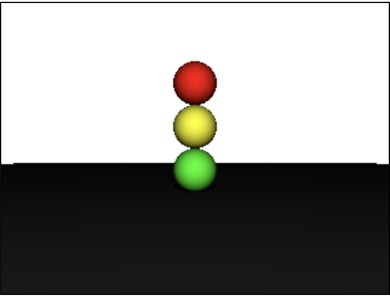
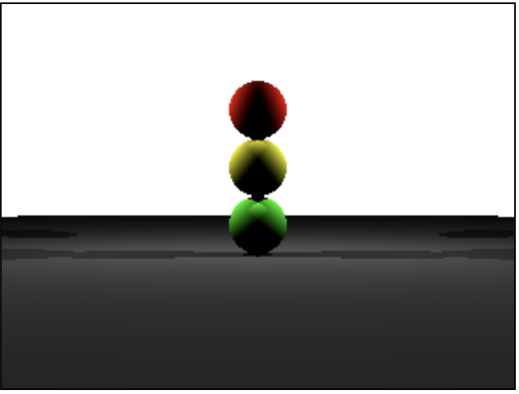

# Homework

## Task 1: Traffic Signal

Following the directions in [hunter.js](raytracer-js/examples/hunter.js), students are to comment out `scene.add(sphere1)` and add their own spheres that resemble a traffic signal.

## Task 2: Two rear lights

Students are to comment out `scene.add(light1)` and add their own symmetrical lights that illuminate the traffic signal from the sides/rear.

The solution can be found in [solution.js](raytracer-js/examples/solution.js)